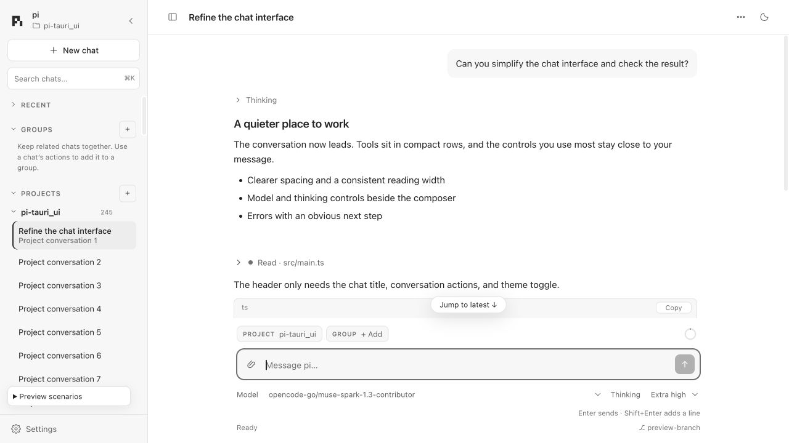
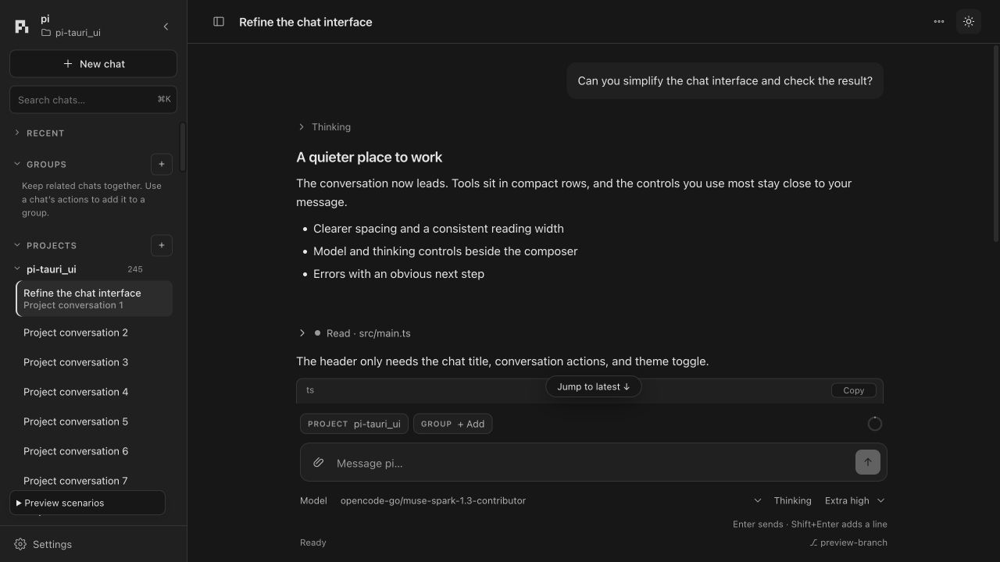
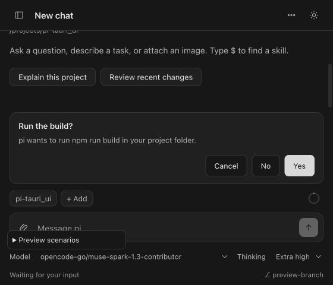
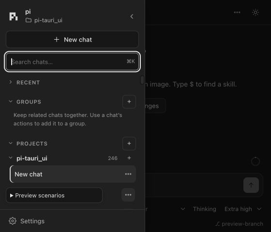

# UI/UX audit and implemented changes

Audited September 30, 2026, starting from `89ad149` (PR #2 merged). All findings below have an implementation in this PR. The work was isolated from the active checkout.

## Scope and method

Read the frontend shell, styles, chat controller, Markdown renderer, conversation reducer, preview fixtures, and native window settings. Checked the Rust event tagging and permission response lookup against the frontend's ownership model. Exercised populated and empty conversations, streaming, tool output, skills, rejected sends, disconnect/retry, navigation, drafts, queues, and permission requests through the real frontend with a deterministic local transport.

The review covered hierarchy, reading comfort, navigation, discoverability, keyboard behavior, focus, screen-reader semantics, forms, recovery, responsive layout, theme consistency, long content, and rendering cost. The project's AGENTS.md is the design contract. The [Web Interface Guidelines](https://raw.githubusercontent.com/vercel-labs/web-interface-guidelines/main/command.md) provided an additional accessibility and interaction checklist. Design choices were reviewed in the actual rendered interface, in light and dark themes, and at desktop and compact widths.

## Design direction

Keep the conversation as the main surface. Use one reading column with shared horizontal padding, a quiet sidebar, consistent controls, and a composer that explains what its actions will do. Keep less common actions in menus while giving those menus visible, keyboard-accessible entry points. Use grayscale tokens in both themes, system fonts for UI, and monospace for code and tool output.

The pleasurable parts are practical: finding a chat without opening every section, keeping a draft when trying a starter, restoring a deleted group, navigating without losing focus, understanding which turn a permission belongs to, and seeing what Enter will do during a run.

## Findings and resolutions

| Priority | Location in final implementation | Finding | Implemented result |
| --- | --- | --- | --- |
| P1 | `src/main.ts:3099` | Background permission replies used the visible chat's scope. | Each request captures its owning cwd/session; replies use that scope and the original RPC id. Background cards name their source. |
| P1 | `src/main.ts:3099` | Different processes could reuse a dialog id; background extension status/editor/title events could change the visible chat. | Dialog keys include ownership. Background editor, title, and status mutations are ignored for the visible chat. Notifications identify their source. |
| P1 | `src/main.ts:1092` | Search results depended on whether sidebar sections were open, making real matches look missing. | A single deduplicated result list searches all loaded chats regardless of section state, names the project, and reports its result count. |
| P1 | `src/main.ts:1116` | Groups rendered every member; each expanded project could add another 100 rows. | All sidebar sections share a 200-chat-row budget. Groups and projects have page controls. Search still sees the full data set. |
| P2 | `src/navigation.ts:4` | Sidebar width could leave too little space for conversation and controls. | A persistent desktop hide/show control, a compact drawer below 760px, and width limits keep the chat usable. Native minimum size becomes 560×480. |
| P2 | `src/main.ts` sidebar resize section | Resizing was available only through dragging. | A labeled separator supports arrow keys, larger Shift+arrow steps, and Home/Enter reset; values stay within bounds. |
| P2 | `src/main.ts` chatButton | Group actions required right-click and were difficult to find. | A separate actions button in each chat row plus Shift+F10/ContextMenu opens the same menu. Controls appear on hover/focus, and remain visible at compact widths and on touch devices. |
| P2 | `src/main.ts:1092` | Rebuilding sidebar rows removed the focused element. | Stable focus keys restore the corresponding control and retain sidebar scroll position; disabled/missing targets fall back to search. |
| P2 | `src/main.ts:1160` | Clearing search took extra editing; Escape could stop a turn. | A clear button, a useful no-match state, Enter/Down to reach results, and Escape that clears only search. |
| P2 | `src/main.ts` newChatInProject | Repeated clicks could create multiple sessions while the first request was pending. | Creation has an in-flight guard, disables other creation/navigation entry points, and shows Creating immediately. |
| P2 | `src/main.ts` removeProject/groupSection | Removing projects or deleting groups was immediate and had no recovery. | Ten-second Undo actions restore the organization without overwriting later group membership changes. Chat files are retained. |
| P2 | `src/accessibility.ts:1` | Dialog focus traps counted hidden controls; background surfaces remained accessible. | Shared focus filtering, focus trapping, inert background panels, and focus restoration. Global navigation shortcuts do not move chats behind a modal. |
| P2 | `src/main.ts` closeModal | Requests arriving behind Settings could be left without useful focus after Settings closed. | Closing a modal focuses a waiting request before returning to the composer. |
| P2 | `src/main.ts:420` | Settings accepted empty folder paths and closed before failures were useful. | Inline field errors, full-path guidance, a Browse button, pending feedback, and retention of the entered path on failure. |
| P2 | `src/main.ts:469` | Rename and group creation silently dismissed empty input; failed rename lost the attempted name. | Required field messages, duplicate group-name guidance, and retained rename input during errors and retries. |
| P2 | `src/main.ts` openProjectPickerModal | A folder could be selected before it had loaded; errors provided little direction. | Select stays disabled until a valid folder loads. Failed navigation retains the last valid folder and explains how to recover. Folder rows use button semantics. |
| P2 | `index.html:88` | Images could be pasted or dropped, but had no visible attachment entry point. | An attachment button opens a filtered file chooser and uses the existing validation, limits, previews, and draft behavior. |
| P2 | `src/main.ts:2416` | Enter changed from sending to steering during a run without clear nearby guidance. | The placeholder, button name, and hint describe steering and queued follow-up behavior; model/thinking controls explain why they are unavailable during a turn. |
| P2 | `src/main.ts` renderSettled | Choosing an empty-state starter overwrote an existing draft. | Starters retain an existing draft and return focus to it. Empty copy also teaches attachments and skill discovery. |
| P2 | `src/main.ts` skill handlers | Escape on skill suggestions could reach the global stop handler; active suggestions were not exposed to assistive technology. | Escape closes only the suggestions; expanded state, active descendant, option selection, and controls association are synchronized. |
| P2 | `src/main.ts:2231` | Context controls were rebuilt during every streamed render, causing focus loss and extra DOM work. | Rebuild only when the project, chat, or its group membership changes. Retain the persistent usage button and focus. |
| P2 | `src/accessibility.ts:16` | Image zoom was click-only. | Attached and Markdown images can expand/shrink with Enter or Space, with a useful accessible name and expanded state. |
| P2 | `src/logic.ts` renderMarkdown | Overflowing tables were difficult to scroll with a keyboard; code copy/collapse states were unclear. | Tables become focusable labeled scroll regions, Copy has a clear name, and long JSON controls expose expanded state. |
| P2 | `src/style.css` focus and token rules | Search/modal controls suppressed the standard focus ring; muted text on the sidebar surface had weak contrast. | Explicit visible focus treatment; the light quiet token changes to #707070 for small text on light surfaces. |
| P3 | `src/style.css` layout rules | Reading and composer padding diverged, while a fixed jump-button offset could cover a taller composer. | Shared gutter tokens, a restrained composer surface, and a Jump to latest control positioned above the actual composer. |
| P3 | `src/style.css` compact and overflow rules | Long model names, paths, group labels, statistics, menus, and notices could squeeze or overflow small windows. | Flexible controls, wrapping, bounded overlays, scroll containment, and responsive insets. |
| P3 | `index.html:28`, `src/style.css` theme rules | The logo and completion dot introduced color outside semantic states; category labels and badges used code typography. | Grayscale token-based logo/completion indicators and system fonts for UI categories. Floating shadows and modal overlays use theme tokens. |
| P3 | `src/main.ts:420` | A manual theme choice could not be returned to following the OS through the UI. | Settings offers Follow system, Light, and Dark while retaining one header sun/moon toggle and before-paint theme application. |
| P3 | `index.html:22` | No fast route past the sidebar for keyboard users; the conversation had no named region. | A visible-on-focus Skip to message link and a labeled Conversation region. |

## Validation

The existing transport/controller tests remain the guard for optimistic sends, retry snapshots, IME input, queue semantics, draft ownership, background runs, tool correlation, and escaped Markdown. The new development-only UX suite adds behavioral checks for search behind closed sections, row limits, paging, modal isolation, validation, Undo, theme restoration, focus stability, skill Escape, background dialog ownership, keyboard resize, menu focus, image zoom, folder recovery, requests arriving behind Settings, and new-chat pending/double-submit behavior.

Reproduce in a clean preview profile:

```sh
npm run build
npm test
npm run dev -- --port 1423 --host 127.0.0.1
# Open http://127.0.0.1:1423/?dev=1
# Preview scenarios → Reset preview state → Run UI regression
# Reset preview state again → Run UX audit checks
npm run tauri build
```

Preview tests send no model prompts. The development controls and messages are excluded from production. Final recorded checks:

- `npm run build`: passed. Total production JavaScript: 102.35 KB uncompressed (31.82 KB gzip), below the 300 KB budget.
- `npm test`: 37 presentation/helper checks and 10 controller/production checks passed.
- `cargo test --manifest-path src-tauri/Cargo.toml`: all 8 Rust tests passed.
- Preview **Run UI regression**: all 46 checks passed on final code.
- Preview **Run UX audit checks**: all 34 checks passed on final code.
- `npm run tauri build`: passed; produced the macOS app and DMG using an isolated Cargo target directory.
- Browser console: no errors observed during either final preview suite.
- Manual compact drawer check: a failed search teaches recovery; first Escape clears it, second Escape closes the drawer; main content is inert while the drawer is open.
- Small-text token contrast on sidebar surfaces: light #707070 on #f7f7f7 is 4.62:1; dark #999999 on #202020 is 5.72:1.
- `git diff --check`: passed.

Visual review sizes included 1280×720, 900×600, 560×480 (native minimum), and 390×700 (preview stress case). The viewport override was reset after review.

| Desktop, light | Desktop, dark |
| --- | --- |
|  |  |

| Compact permission request | Compact chats drawer |
| --- | --- |
|  |  |

## Performance and implementation boundaries

No runtime package, webfont, image asset, framework, polling loop, or interval was added. Sidebar rendering is bounded, streaming still uses requestAnimationFrame, and navigation/theme changes use events. The existing notice timer is reused for Undo. The existing running indicator remains the documented project exception to reduced motion; decorative transitions and caret behavior still respect reduced motion. The Rust process pool and CLI protocol are unchanged.

The audit verifies behavior through the same frontend/event path with deterministic transport fixtures and verifies native packaging. It does not certify every screen-reader/browser combination or measure whole-system idle CPU. Native OS file chooser behavior and model-provider dialogs can vary with the installed OS/extensions. Existing image validation and backend scoping remain the boundary for file selection and permissions.
